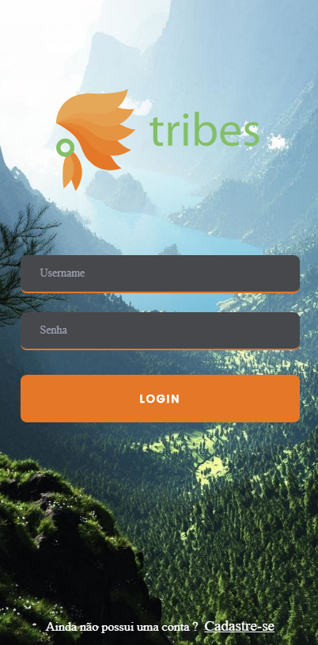
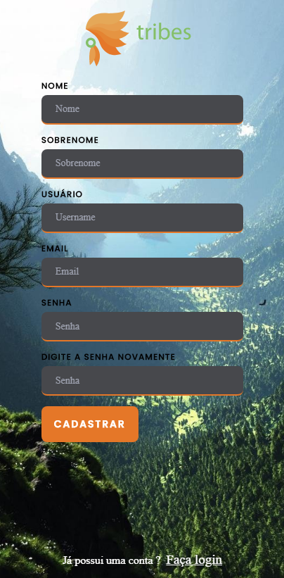
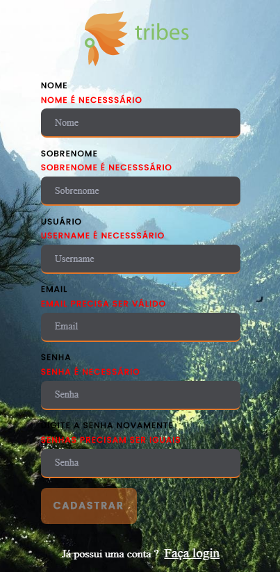
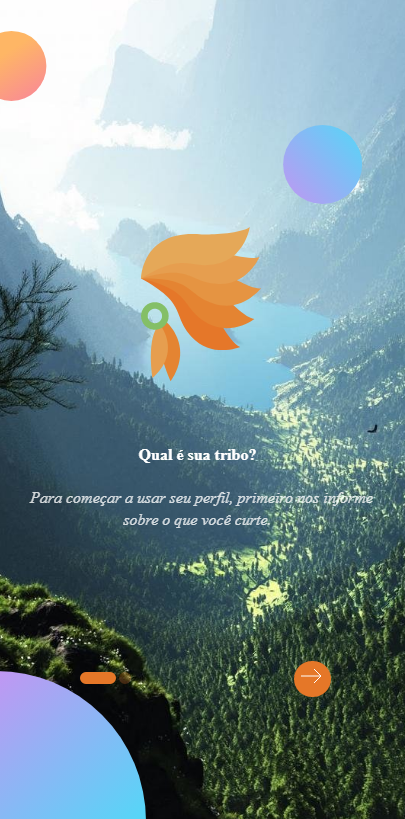
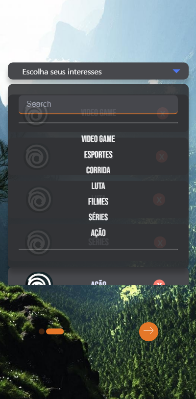
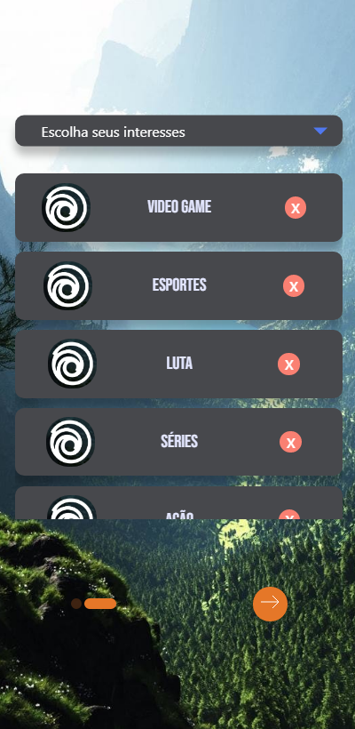
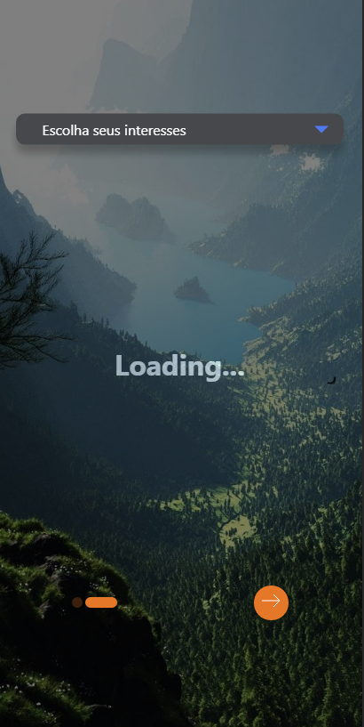
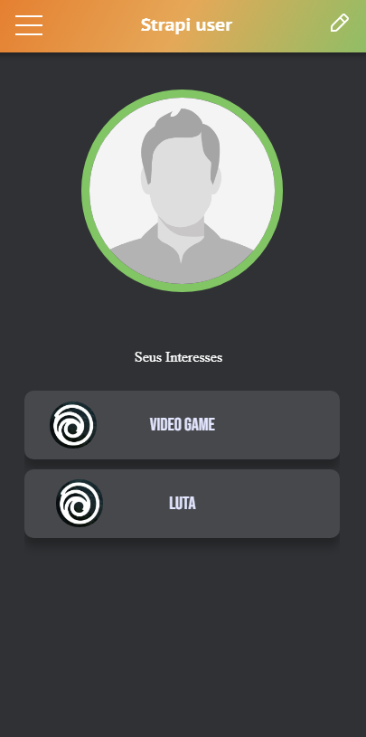
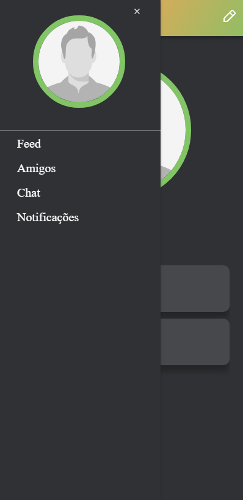

# Primeiro app com Redux (Em Desenvolvimento)

Aplicação responsiva.

Projeto com login e cadastro de usuário.

Backend para cadastro está em outro repo e foi feito com [Strapi](https://strapi-redux.herokuapp.com/).

## Prints da Aplicação

 
### `yarn start`

Inicia a aplicação no localhost:3000.

<!-- **Note: this is a one-way operation. Once you `eject`, you can’t go back!** -->

<!-- You can learn more in the [Create React App documentation](https://facebook.github.io/create-react-app/docs/getting-started). -->